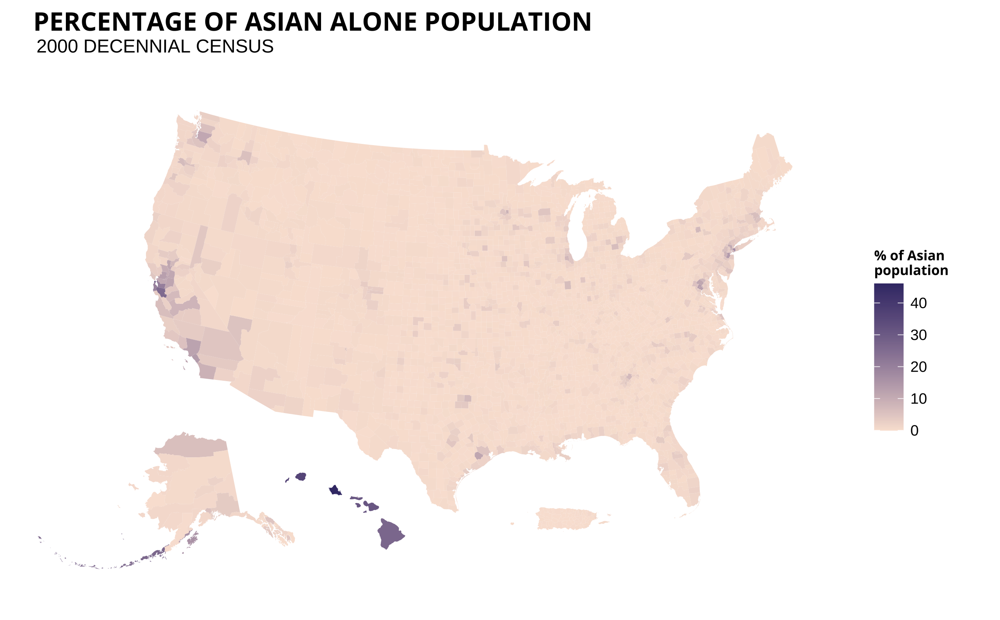
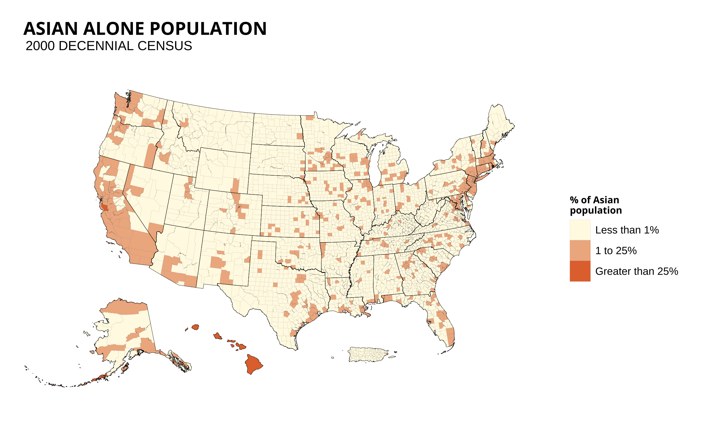

```{r setup, include=FALSE}
knitr::opts_chunk$set(echo = TRUE)
```

<br> 

# Asian Alone population
Decennial Census 2000, 2010, 2020

<br> 

## State analysis 

<br> 

### 2010 - Single color
 


### 2010 - 2 color scale


### 2020


## District analysis 
<br> 

### 2000

Using R's built in color palette: 


Messing around with colors picked from AAJC sample report: 



<u> Maps using discrete scales (binning) </u> 

* There are no counties with % greater than 48 so "Greater than 25%" was used as the highest bin/factor

<br>


<br> 

Exact match to AAJC report: 


<br>

Exact match to AAJC report w/ zero percentages ie. showing counties with no asian alone population colored in as white: 


<br> 

# Asian Alone or in Combination

Decennial Census 2000, 2010 

__had trouble finding this variable for the year 2020__ 

<br> 

## State analysis 

### 2000


### 2010


## District Analysis 

### 2000


<br> 
<br> 

# NHPI Alone

Decennial Census 2000, 2010 


<br> 

## State analysis 

### 2000


### 2010


### 2020


## District Analysis 

### 2000

  * 13% of US counties have 0% NHPI pop. which is a lot higher than AA alone and AA in combination. So, 0% category was included 


<br>
<br>
Notes: 

* will have to export as svg. To combat pixelation in AAJC's sample report and in my pdf export
* District maps are missing for 2010 & 2020. Can lock down a style first and then just have to plug in years and variable names to produce missing maps
